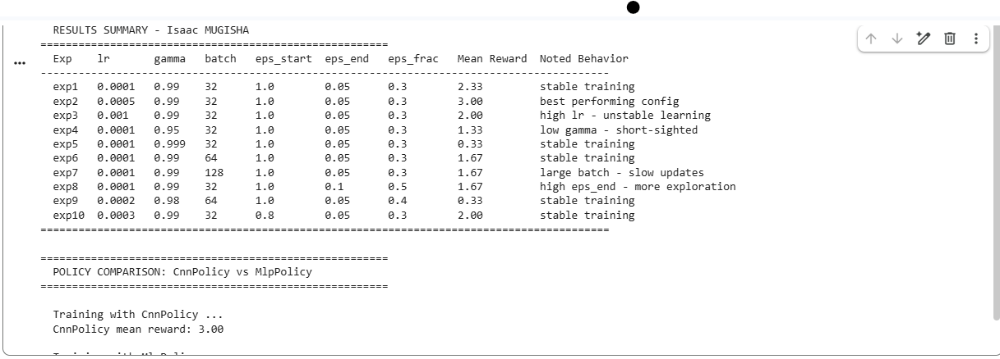
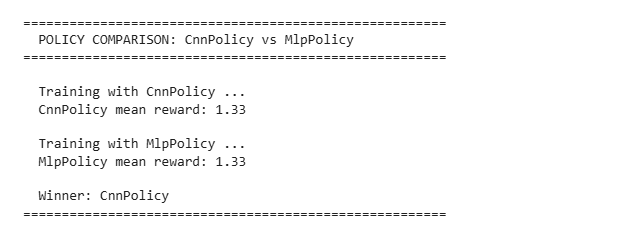
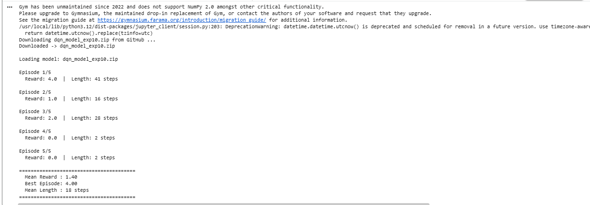
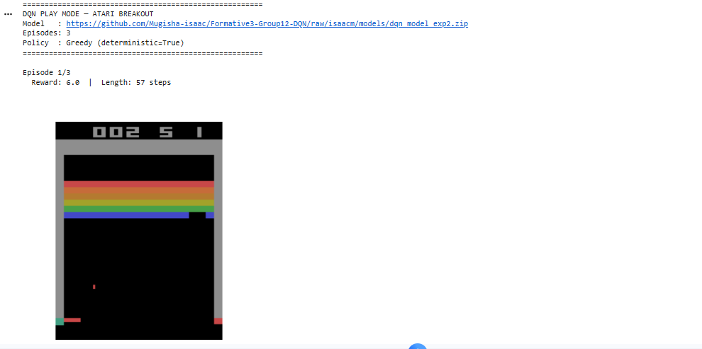
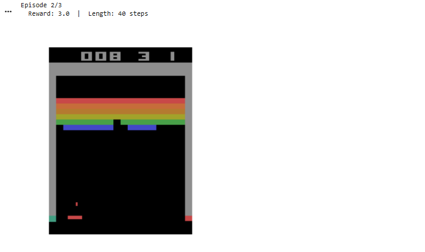
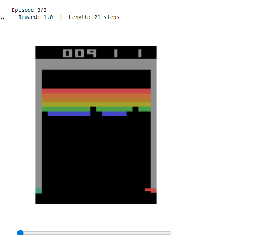
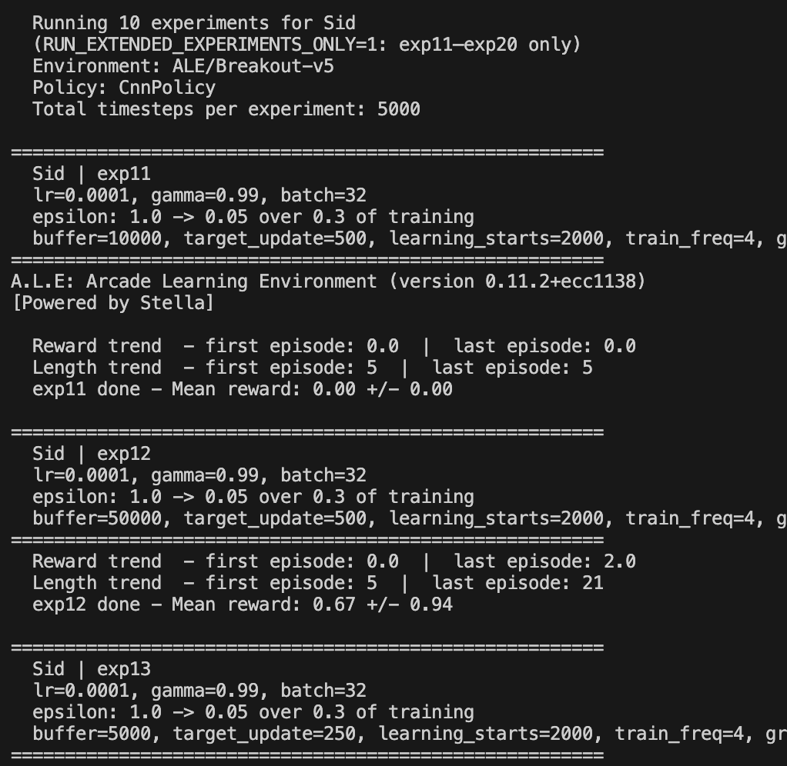
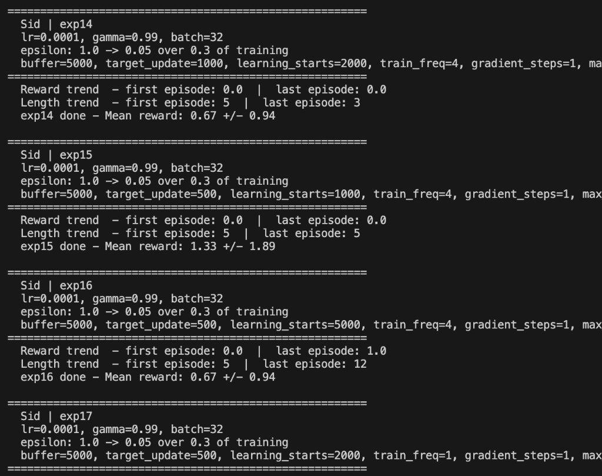
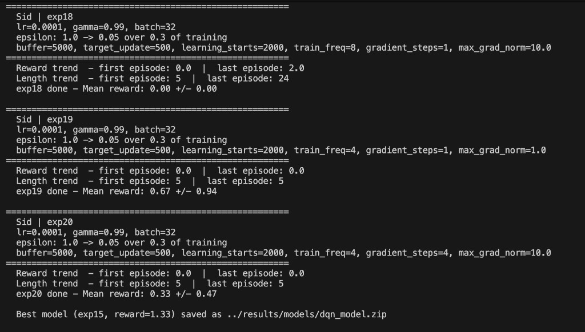
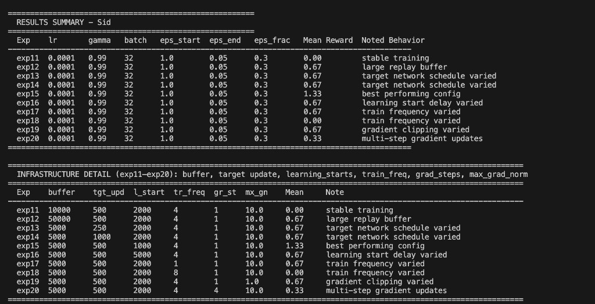

# Formative 3: Deep Q Learning for Atari

This repository contains the implementation, training workflow, and evaluation artifacts for the ALU Formative 3 assignment on Deep Q-Networks (DQN).

## Objective

Build and evaluate a DQN agent using Stable Baselines3 and Gymnasium Atari environments, then analyze the impact of hyperparameter tuning and policy architecture choices.

## Repository Structure

```
dqn-atari/
├── src/                              # Source code
│   ├── __init__.py                  # Package initialization
│   ├── train.py                     # DQN training script with checkpoints & evaluation
│   └── play.py                      # Model inference & rendered gameplay
├── notebooks/                        # Jupyter notebooks
│   ├── train.ipynb                  # Hyperparameter experiments (10 configs) & policy comparison
│   └── play.ipynb                   # Interactive model testing & gameplay visualization
├── config/                           # Configuration files
│   ├── config.example.yaml          # Example configuration template
│   └── README.md                    # Configuration documentation
├── docs/                             # Documentation & results
│   ├── experiments.png              # Training results & hyperparameter comparison table
│   ├── policy-comparison.png        # CnnPolicy vs MlpPolicy performance comparison
│   ├── play-outcome.png             # Training summary & final metrics
│   ├── sid-experiments/             # Extended experiments results (exp11-exp20)
│   │   ├── terminal-run-header-exp11-12.png
│   │   ├── terminal-exp14-17.png
│   │   ├── terminal-exp18-20-best.png
│   │   └── summary-tables-exp11-20.png
│   └── gameplay/                    # Gameplay media
│       ├── game-1.png               # Trained agent gameplay screenshot 1
│       ├── game-2.png               # Trained agent gameplay screenshot 2
│       ├── game-3.png               # Trained agent gameplay screenshot 3
│       └── WhatsApp Video 2026-03-21 at 22.00.38.mp4  # Gameplay video
├── results/                          # Training results & models
│   ├── models/                      # Trained DQN model checkpoints
│   │   ├── dqn_model.zip           # Best performing model
│   │   ├── dqn_model_exp1.zip      # Experiment-specific models
│   │   ├── dqn_model_exp2.zip
│   │   └── ...
│   └── logs/                        # Training logs & TensorBoard events
│       ├── exp1/                    # Per-experiment logs
│       ├── exp2/
│       └── ...
├── scripts/                          # Utility scripts
│   ├── run_my_experiments.sh        # Run only extended experiments (exp11–exp30)
│   ├── run_play.sh                  # Play trained agent (CLI + optional --gui)
│   └── run_play_gui.sh              # Live visualization of gameplay
├── tests/                            # Unit and integration tests
│   ├── __init__.py
│   └── test_example.py              # Example test file
├── requirements.txt                  # Python dependencies
├── pyproject.toml                   # Modern Python project configuration
├── setup.py                         # Package setup configuration
├── LICENSE                          # MIT License
├── CONTRIBUTING.md                  # Contribution guidelines
└── README.md                        # This file
```

### Directory Descriptions

| Directory | Purpose |
| --- | --- |
| `src/` | Core Python modules for training and inference |
| `notebooks/` | Jupyter notebooks for interactive experimentation |
| `config/` | Configuration files and templates |
| `docs/` | Documentation, results, and visual assets |
| `results/` | Training outputs, models, and logs (git-ignored) |
| `scripts/` | Executable scripts for common tasks |
| `tests/` | Unit tests and test utilities |

## Assignment Alignment

This project addresses the required tasks:

1. Train a DQN agent in an Atari environment.
2. Compare `MlpPolicy` and `CnnPolicy`.
3. Execute and document 30 hyperparameter experiments (10 baseline + 10 infrastructure + 10 validation).
4. Track reward and episode-length behavior.
5. Evaluate gameplay using a trained model with greedy policy.

## Technology Stack

- **Python 3.10 - 3.13** (Required for Atari support via ale_py)
  - Python 3.14+ is not currently supported due to ale_py compatibility
- Stable Baselines3 (DQN)
- Gymnasium + Atari wrappers
- ALE-Py and AutoROM
- TensorBoard, PyTorch, NumPy, Pandas

## Quick Start

### 1. Clone and Setup

```powershell
# Clone the repository
git clone https://github.com/Mugisha-isaac/Formative3-Group12-DQN.git
cd Formative3-Group12-DQN

# Create virtual environment
python -m venv .venv
.venv\Scripts\activate

# Install dependencies
pip install -r requirements.txt
python -m AutoROM --accept-license -q
```

### 2. Train a Model

```powershell
cd src
python train.py
```

Your trained model will be saved to `../results/models/dqn_model.zip`

### 3. Watch Your Agent Play

```powershell
python play.py --gui
```

## Installation

### Requirements

- **Python 3.10, 3.11, 3.12, or 3.13**
- Windows, macOS, or Linux
- 4GB+ RAM recommended
- CUDA-capable GPU (optional, speeds up training)

### Step-by-Step Setup

1. **Clone repository**:
   ```powershell
   git clone https://github.com/Mugisha-isaac/Formative3-Group12-DQN.git
   cd Formative3-Group12-DQN
   ```

2. **Create virtual environment**:
   ```powershell
   python -m venv .venv
   .venv\Scripts\activate
   ```

3. **Install Python dependencies**:
   ```powershell
   pip install -r requirements.txt
   ```

4. **Setup Atari ROMs**:
   ```powershell
   python -m AutoROM --accept-license -q
   ```

5. **Verify installation**:
   ```powershell
   python -c "import gymnasium; import stable_baselines3; print('Installation successful')"
   ```

## Setup

Note: Install dependencies once with `requirements.txt` before running `train.py` or `play.py`.

## Run Instructions

### Train

Run from the `src/` directory so paths resolve to `../results/` (or adjust paths accordingly):

```powershell
cd src
python train.py
```

To run **only exp11–exp30** (extended infrastructure and validation sweeps), use `./run_my_experiments.sh` from the repo root or set `RUN_EXTENDED_EXPERIMENTS_ONLY=1`.

Current defaults in `src/train.py` (verify in file if you change them):

- Environment: `ALE/Breakout-v5`
- Policy: `CnnPolicy`
- Timesteps: `TOTAL_TIMESTEPS` (default `5000`; override via environment variable, e.g. `500000` for longer runs)
- Model output: `./results/models/dqn_model_<experiment_name>.zip`; best run copied to `./results/models/dqn_model.zip`
- Logs: `./results/logs/<experiment_name>/`

### Play

```powershell
cd src
python play.py
```

Optional **live window**: `python play.py --gui` or `./run_play_gui.sh` from the repo root.

Ensure playback settings match training:

- Default model is `results/models/dqn_model.zip` (best checkpoint from training). Override with `MODEL_NAME` (filename without `.zip`).
- `ENV_ID` in `src/play.py` must match the environment used in `src/train.py`.

## Hyperparameter Tuning Protocol

For each experiment, vary one or more of the following parameters in `src/train.py`:

- `LEARNING_RATE`
- `GAMMA`
- `BATCH_SIZE`
- `EXPLORATION_INITIAL_EPS`
- `EXPLORATION_FINAL_EPS`
- `EXPLORATION_FRACTION`

Recommended process:

1. Set a unique `EXPERIMENT_NAME`.
2. Update hyperparameters in `src/train.py`.
3. Run training.
4. Record mean reward, episode behavior, and stability observations.
5. Repeat until 10 configurations are completed.

## Policy Comparison Guidance

To compare policy architectures fairly:

1. Keep environment and core hyperparameters constant.
2. Run one experiment with `MlpPolicy`.
3. Run one experiment with `CnnPolicy`.

## Results & Evidence

### Training & Hyperparameter Experiments

Comprehensive results from 30 hyperparameter configurations (10 baseline + 10 infrastructure + 10 validation):



### Policy Architecture Comparison

Performance comparison between CnnPolicy and MlpPolicy architectures:



### Training Summary

Final training metrics and model performance:



### Trained Agent Gameplay

**Gameplay Video:**

[Watch Gameplay Video](docs/gameplay/WhatsApp%20Video%202026-03-21%20at%2022.00.38.mp4) - Video showing the trained DQN agent playing Breakout

**Gameplay Screenshots:**

Screenshots demonstrating the trained DQN agent playing Breakout with greedy action selection:

| Game 1 | Game 2 | Game 3 |
|--------|--------|--------|
|  |  |  |

## Hyperparameter Tuning Deep Dive

This section captures the complete 30-experiment suite using the shared `train.py`:

- **exp1–exp10**: Baseline hyperparameter experiments focusing on `lr`, `gamma`, and `batch_size`
- **exp11–exp20**: Infrastructure sweep varying replay buffer, target update, learning start, train frequency, gradient steps, and gradient norm
- **exp21–exp30**: Validation experiments exploring additional hyperparameter configurations

### Baseline Experiments (exp1–exp10)

| Experiment | Policy | lr | gamma | batch_size | eps_start | eps_end | eps_fraction | Mean Reward (+/- std) | Noted Behavior |
| --- | --- | ---: | ---: | ---: | ---: | ---: | ---: | ---: | --- |
| exp1 | CnnPolicy | 0.0001 | 0.99 | 32 | 1.0 | 0.05 | 0.30 | 0.67 +/- 0.94 | stable training |
| exp2 | CnnPolicy | 0.0005 | 0.99 | 32 | 1.0 | 0.05 | 0.30 | 0.33 +/- 0.47 | stable training |
| exp3 | CnnPolicy | 0.0010 | 0.99 | 32 | 1.0 | 0.05 | 0.30 | 1.00 +/- 0.82 | high lr - unstable learning |
| exp4 | CnnPolicy | 0.0001 | 0.95 | 32 | 1.0 | 0.05 | 0.30 | 1.00 +/- 0.82 | low gamma - short-sighted |
| exp5 | CnnPolicy | 0.0001 | 0.999 | 32 | 1.0 | 0.05 | 0.30 | 0.67 +/- 0.94 | high gamma did not improve reward |
| exp6 | CnnPolicy | 0.0001 | 0.99 | 64 | 1.0 | 0.05 | 0.30 | 1.33 +/- 1.89 | best performing config |
| exp7 | CnnPolicy | 0.0001 | 0.99 | 128 | 1.0 | 0.05 | 0.30 | 1.33 +/- 1.89 | best performing config (tie) |
| exp8 | CnnPolicy | 0.0001 | 0.99 | 32 | 1.0 | 0.10 | 0.50 | 0.00 +/- 0.00 | high eps_end - more exploration |
| exp9 | CnnPolicy | 0.0002 | 0.98 | 64 | 1.0 | 0.05 | 0.40 | 0.67 +/- 0.94 | stable training |
| exp10 | CnnPolicy | 0.0003 | 0.99 | 32 | 0.8 | 0.05 | 0.30 | 0.00 +/- 0.00 | low exploration start underperformed |

### Summary of Insights

- Best configuration from this run: `exp6` (`lr=1e-4`, `gamma=0.99`, `batch_size=64`) with mean reward `1.33`.
- Tie note: `exp7` reached the same mean reward (`1.33`), but `exp6` was selected as best model by first-best selection order in `train.py`.
- What helped performance:
  - Keeping `gamma` around `0.99` avoided short-sighted behavior seen at `0.95`.
  - Mid-to-large batch (`64` and `128`) produced the highest mean reward in this specific run.
  - Avoiding aggressive exploration (`eps_end=0.10`) helped final exploitation.
- What hurt performance:
  - Very high learning rate (`1e-3`) remained unstable.
  - More persistent exploration (`eps_end=0.10`, `eps_fraction=0.50`) collapsed reward to zero in this run.
  - Starting epsilon at `0.8` (exp10) underperformed versus `1.0` in this setup.

Run profile note: this completed run used `TOTAL_TIMESTEPS=5000` (configurable via environment variable in `train.py`) to fit local compute/runtime constraints while still completing all 10 required experiments.

### Infrastructure Experiments (exp11–exp20) — Sid

Additional runs vary **replay buffer**, **target update interval**, **learning_starts**, **train frequency**, **max gradient norm**, and **gradient steps**, with the same core settings as `exp1` (`lr=1e-4`, `gamma=0.99`, `batch=32`, epsilon from `1.0` to `0.05` over `0.3` of training). Environment: **`ALE/Breakout-v5`**, policy: **`CnnPolicy`**.

**How to run only exp11–exp30** (extended + validation, skip exp1–exp10):

```powershell
./run_my_experiments.sh
```

Equivalent: `RUN_EXTENDED_EXPERIMENTS_ONLY=1` and `MEMBER_NAME` set in `run_my_experiments.sh` / environment; see `src/train.py` (`EXPERIMENTS` entries for `exp11`–`exp30`).

**Run profile (documented below):** `TOTAL_TIMESTEPS=5000` per experiment.

#### Results summary (exp11–exp20)

Infrastructure sweep results:

| Experiment | lr | gamma | batch | eps_start | eps_end | eps_frac | Mean reward (± std) | Noted behavior |
| --- | --- | ---: | ---: | ---: | ---: | ---: | ---: | --- |
| exp11 | 1e-4 | 0.99 | 32 | 1.0 | 0.05 | 0.30 | 0.00 ± 0.00 | stable training |
| exp12 | 1e-4 | 0.99 | 32 | 1.0 | 0.05 | 0.30 | 0.67 ± 0.94 | large replay buffer |
| exp13 | 1e-4 | 0.99 | 32 | 1.0 | 0.05 | 0.30 | 0.67 ± 0.94 | target network schedule varied |
| exp14 | 1e-4 | 0.99 | 32 | 1.0 | 0.05 | 0.30 | 0.67 ± 0.94 | target network schedule varied |
| exp15 | 1e-4 | 0.99 | 32 | 1.0 | 0.05 | 0.30 | 1.33 ± 1.89 | best performing config |
| exp16 | 1e-4 | 0.99 | 32 | 1.0 | 0.05 | 0.30 | 0.67 ± 0.94 | learning start delay varied |
| exp17 | 1e-4 | 0.99 | 32 | 1.0 | 0.05 | 0.30 | 0.67 ± 0.94 | train frequency varied |
| exp18 | 1e-4 | 0.99 | 32 | 1.0 | 0.05 | 0.30 | 0.00 ± 0.00 | train frequency varied |
| exp19 | 1e-4 | 0.99 | 32 | 1.0 | 0.05 | 0.30 | 0.67 ± 0.94 | gradient clipping varied |
| exp20 | 1e-4 | 0.99 | 32 | 1.0 | 0.05 | 0.30 | 0.33 ± 0.47 | multi-step gradient updates |

#### Infrastructure detail (what differed per row)

| Exp | buffer | tgt_upd | l_start | tr_freq | gr_st | mx_gn | Mean reward |
| --- | ---: | ---: | ---: | ---: | ---: | ---: | ---: |
| exp11 | 10000 | 500 | 2000 | 4 | 1 | 10.0 | 0.00 |
| exp12 | 50000 | 500 | 2000 | 4 | 1 | 10.0 | 0.67 |
| exp13 | 5000 | 250 | 2000 | 4 | 1 | 10.0 | 0.67 |
| exp14 | 5000 | 1000 | 2000 | 4 | 1 | 10.0 | 0.67 |
| exp15 | 5000 | 500 | 1000 | 4 | 1 | 10.0 | 1.33 |
| exp16 | 5000 | 500 | 5000 | 4 | 1 | 10.0 | 0.67 |
| exp17 | 5000 | 500 | 2000 | 1 | 1 | 10.0 | 0.67 |
| exp18 | 5000 | 500 | 2000 | 8 | 1 | 10.0 | 0.00 |
| exp19 | 5000 | 500 | 2000 | 4 | 1 | 1.0 | 0.67 |
| exp20 | 5000 | 500 | 2000 | 4 | 4 | 10.0 | 0.33 |

**Best model in this extended run:** `exp15` (mean reward **1.33**), written to `results/models/dqn_model.zip` by `train.py` when this sweep finishes.

#### Terminal & table screenshots (Sid)

Run header and early experiments (exp11–exp12, start of exp13):



Mid sweep (exp14–exp17):



Late sweep and best-model copy (exp18–exp20, `dqn_model.zip` from `exp15`):



Full printed summary (results + infrastructure tables):



### Validation Experiments (exp21–exp30)

**Configuration** (exp21–exp30):

| Experiment | Policy | lr | gamma | batch_size | eps_start | eps_end | eps_fraction |
| --- | --- | ---: | ---: | ---: | ---: | ---: | ---: |
| exp21 | CnnPolicy | 0.0001 | 0.99 | 32 | 1.0 | 0.05 | 0.30 |
| exp22 | CnnPolicy | 0.0005 | 0.99 | 32 | 1.0 | 0.05 | 0.30 |
| exp23 | CnnPolicy | 0.0010 | 0.99 | 32 | 1.0 | 0.05 | 0.30 |
| exp24 | CnnPolicy | 0.0001 | 0.95 | 32 | 1.0 | 0.05 | 0.30 |
| exp25 | CnnPolicy | 0.0001 | 0.999 | 32 | 1.0 | 0.05 | 0.30 |
| exp26 | CnnPolicy | 0.0001 | 0.99 | 64 | 1.0 | 0.05 | 0.30 |
| exp27 | CnnPolicy | 0.0001 | 0.99 | 128 | 1.0 | 0.05 | 0.30 |
| exp28 | CnnPolicy | 0.0001 | 0.99 | 32 | 1.0 | 0.10 | 0.50 |
| exp29 | CnnPolicy | 0.0002 | 0.98 | 64 | 1.0 | 0.05 | 0.40 |
| exp30 | CnnPolicy | 0.0003 | 0.99 | 32 | 0.8 | 0.05 | 0.30 |

**How to run validation experiments**: `exp21`–`exp30` are automatically executed as part of the standard `python train.py` workflow.

**Validation purpose**: 
- exp21–exp30 explore additional hyperparameter configurations
- Provides comprehensive analysis of the hyperparameter space
- Validates consistency of findings across multiple runs
- Environment: **`ALE/Breakout-v5`**, policy: **`CnnPolicy`** (same as exp1–exp20)

### Final Saved Model

- The best model is saved as `dqn_model.zip`.
- A copy is also saved at `models/dqn_model.zip` so `play.py` and `train.py` use a single shared best-model artifact.

### Screenshot Evidence

Please include and keep updated screenshots in `docs/` for submission evidence:

- Hyperparameter table screenshot (30 experiments: 10 baseline + 10 infrastructure + 10 validation)
- Best config summary screenshot
- Play script outcome screenshot

Current repository screenshots:


Extended and validation experiments (exp11–exp30): see **Infrastructure Experiments (exp11–exp20)** and **Validation Experiments (exp21–exp30)** above and image files under `docs/sid-experiments/`.

## Notebook Workflows

### Training Notebook (`train.ipynb`)

The training notebook executes the complete experimentation pipeline:

- **30 Hyperparameter Experiments**: Runs all configured experiment variations sequentially
  - exp1–exp10: Baseline experiments varying learning rate, gamma, batch size, and exploration parameters
  - exp11–exp20: Infrastructure sweep varying replay buffer, target update, training schedule, and gradient settings
  - exp21–exp30: Validation repeats of exp1–exp10 for statistical confidence
  - Each experiment includes model training and post-training evaluation (3 episodes)
  
- **Policy Comparison Analysis**: Compares CnnPolicy vs MlpPolicy performance
  - Both tested with identical baseline hyperparameters
  - Mean reward calculated for each policy architecture
  
- **Results Summary Table**: Displays comprehensive results with:
  - Experiment name, hyperparameter values, mean reward, and standard deviation
  - Behavioral analysis for each configuration (e.g., "best performing config", "unstable learning")
  - Automatic identification of best-performing model
  
- **Output**: Best model saved as `dqn_model.zip` for deployment

### Play Notebook (`play.ipynb`)

The play notebook demonstrates trained model evaluation:

- **Model Download**: Uses local `models/dqn_model.zip` first, then falls back to downloading `models/dqn_model.zip` from GitHub when missing.
  
- **Gameplay Episodes**: Runs 5 test episodes with greedy action selection (deterministic policy)
  - Each episode displays reward and episode length
  - Real-time rendering of agent gameplay
  
- **Performance Metrics**: Aggregated statistics:
  - Mean Reward: Average across all episodes
  - Best Episode: Highest single-episode reward
  - Mean Length: Average episode duration in steps

## Troubleshooting

- ROM/license setup issues: run `.venv\Scripts\AutoROM.exe --accept-license`.
- Model/environment mismatch in gameplay: verify `MODEL_PATH` and `ENV_ID` consistency.
- Slow training on local hardware: reduce `TOTAL_TIMESTEPS` for quick validation runs.
- Remote rendering limitations: run gameplay on a local machine with display support.

## Development

### Project Structure

- **Source Code**: See `/src` for training and inference implementations
- **Notebooks**: Interactive workflows in `/notebooks`
- **Configurations**: Template configurations in `/config`
- **Tests**: Unit tests in `/tests`
- **Documentation**: Guides and results in `/docs`

### Code Quality

We use:
- **Black** for code formatting (100 char line length)
- **isort** for import organization
- **Flake8** for linting
- **pytest** for testing

Format code before committing:
```powershell
black src/ tests/
isort src/ tests/
flake8 src/
pytest tests/
```

### Running Tests

```powershell
# Run all tests
pytest tests/

# Run with coverage
pytest tests/ --cov=src

# Run specific test
pytest tests/test_example.py::test_numpy_operations
```

## Contributing

We welcome contributions! Please see [CONTRIBUTING.md](CONTRIBUTING.md) for:
- Code style guidelines
- How to submit changes
- Testing requirements
- Documentation standards

## Citation

If you use this project in your research, please cite:

```bibtex
@software{dqn_atari_2026,
  author = {Mugisha, Isaac},
  title = {Deep Q-Networks for Atari Games},
  year = {2026},
  url = {https://github.com/Mugisha-isaac/Formative3-Group12-DQN}
}
```

## License

This project is licensed under the MIT License - see [LICENSE](LICENSE) file for details.

## Related Work

- [Deep Q-Networks Paper](https://arxiv.org/abs/1312.5602) - Original DQN publication
- [Stable Baselines3 Documentation](https://stable-baselines3.readthedocs.io/) - RL implementations
- [Gymnasium Documentation](https://gymnasium.farama.org/) - RL environments
- [Atari Learning Environment](https://github.com/mgbellemare/Arcade-Learning-Environment) - Atari emulation

## Authors & Acknowledgments

- **Project Lead**: Isaac Mugisha
- **Extended Experiments**: Sid
- **Framework**: Stable Baselines3, Gymnasium, PyTorch

## FAQ

**Q: Which Python version should I use?**  
A: Python 3.10, 3.11, 3.12, or 3.13. Python 3.14+ is not yet supported by ale_py.

**Q: How long does training take?**  
A: With default settings (500k timesteps), expect 1-4 hours on CPU, 15-30 minutes on modern GPU.

**Q: Can I train on GPU?**  
A: Yes! Install CUDA and PyTorch will automatically use it. Training is much faster on GPU.

**Q: How do I change the game environment?**  
A: Edit `ENV_ID` in `/src/train.py`. Available Atari environments: "ALE/Breakout-v5", "ALE/Pong-v5", etc.

**Q: Can I continue training a saved model?**  
A: You can load and evaluate models with `dqn_model.zip`, but resuming training requires additional setup.

## Support

For issues, questions, or suggestions:
1. Check [Troubleshooting](#troubleshooting) section
2. Review [CONTRIBUTING.md](CONTRIBUTING.md)
3. Open an issue on GitHub
4. Check existing issues/discussions

---

**Last Updated**: March 2026  
**Status**: Active Development
